# 🏥 GlucoPredict — Diabetes Risk Prediction System

> An AI-powered, educational web app that estimates a person's likelihood of diabetes from eight clinical measurements, using a Support Vector Machine (SVM) trained on the Pima Indians Diabetes dataset and served through a Streamlit interface.

> ⚠️ **Medical disclaimer:** GlucoPredict is a machine-learning learning project. It is **not** a diagnostic tool and must not replace advice from a qualified healthcare professional.

---

## 📑 Table of Contents

1. [Overview](#-overview)
2. [Key Features](#-key-features)
3. [Tech Stack](#-tech-stack)
4. [Repository Structure](#-repository-structure)
5. [System Architecture](#-system-architecture)
6. [Machine Learning Pipeline](#-machine-learning-pipeline)
7. [Dataset & Features](#-dataset--features)
8. [Application Workflow](#-application-workflow)
9. [Risk Classification Logic](#-risk-classification-logic)
10. [Risk Factor & Recommendation Engine](#-risk-factor--recommendation-engine)
11. [UML & Design Diagrams](#-uml--design-diagrams)
12. [Installation & Usage](#-installation--usage)
13. [Deployment](#-deployment)
14. [Limitations & Known Issues](#-limitations--known-issues)
15. [Future Improvements](#-future-improvements)
16. [Contributing, License & Acknowledgements](#-contributing-license--acknowledgements)

---

## 🔎 Overview

Diabetes is often diagnosed late. GlucoPredict demonstrates how a classical ML model can turn routine clinical measurements into an instant, interpretable **risk estimate**.

A user enters eight values in a sidebar form. The app standardises them with a saved `StandardScaler`, feeds them to a pre-trained SVM, and displays:

- a **binary prediction** (Diabetic / Non-diabetic),
- a **probability breakdown** and an interactive **risk gauge**,
- a **three-tier risk label** (Low / Moderate / High),
- **rule-based risk factors** and **positive health indicators**,
- **general recommendations** and a medical disclaimer.

---

## ✨ Key Features

| Feature | Description |
|---|---|
| 🧮 SVM classifier | Pre-trained model loaded from `diabetes_model.pkl` |
| 📏 Feature scaling | Same `StandardScaler` used in training, loaded from `scaler_svm.pkl` |
| 🎛️ Interactive inputs | Sliders and number inputs with clinically sensible ranges |
| 📊 Plotly gauge | Colour-banded (green / yellow / red) risk meter |
| 🧠 Risk factor analysis | Transparent, rule-based flags for glucose, BMI, age, BP, pedigree |
| 💡 Recommendations | Different guidance for positive vs. negative predictions |
| 🛡️ Graceful errors | Clear messages if model files are missing or inputs mismatch |
| ⚡ Cached loading | `@st.cache_resource` loads the model once per session |

---

## 🧰 Tech Stack

| Layer | Technology |
|---|---|
| Language | Python |
| Web UI | Streamlit |
| Data handling | pandas, NumPy |
| ML | scikit-learn (SVM, StandardScaler) |
| Persistence | joblib (`.pkl` artefacts) |
| Visualisation | Plotly (`graph_objects.Indicator`) |
| Experimentation | Jupyter Notebook |

---

## 📁 Repository Structure

```text
GlucoPredict/
│
├── app.py                      # Streamlit web application
├── diabetes-prediction.ipynb   # EDA, preprocessing, training & evaluation
├── diabetes.csv                # Pima Indians Diabetes dataset (768 rows)
├── diabetes_model.pkl          # Trained SVM model
├── scaler_svm.pkl              # Fitted StandardScaler
├── requirements.txt            # Python dependencies
└── .gitignore
```

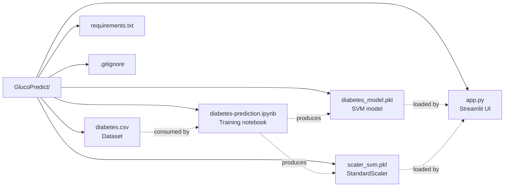

---

## 🏗️ System Architecture

### High-level architecture

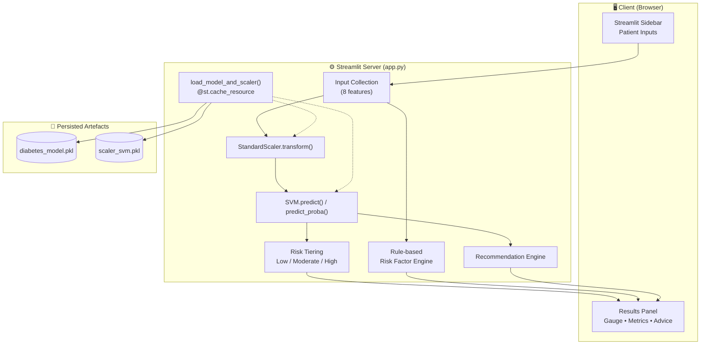

### Layered view

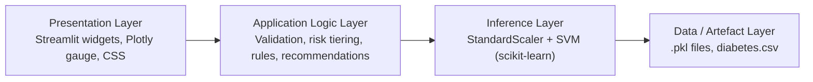

---

## 🤖 Machine Learning Pipeline

### Training pipeline (notebook)

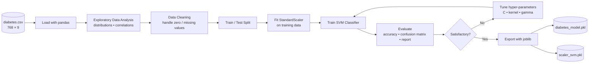

> The notebook's exact preprocessing and tuning steps are best documented by the author; the stages above reflect the standard pipeline implied by the saved artefacts (`scaler_svm.pkl`, `diabetes_model.pkl`) and the reported ~78 % accuracy.

### Inference pipeline (app)

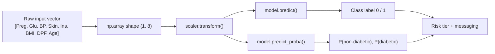

---

## 📊 Dataset & Features

The data follows the **Pima Indians Diabetes Database** schema (768 records, 8 predictors, 1 binary target).

| # | Feature | Unit | UI Control | UI Range |
|---|---|---|---|---|
| 1 | Pregnancies | count | Number input | 0 – 20 |
| 2 | Glucose | mg/dL | Slider | 0 – 200 |
| 3 | BloodPressure | mm Hg | Slider | 0 – 130 |
| 4 | SkinThickness | mm | Slider | 0 – 100 |
| 5 | Insulin | µU/mL | Slider | 0 – 900 |
| 6 | BMI | kg/m² | Number input | 10.0 – 70.0 |
| 7 | DiabetesPedigreeFunction | score | Slider | 0.0 – 2.5 |
| 8 | Age | years | Slider | 21 – 100 |
| — | **Outcome** (target) | 0 / 1 | — | Non-diabetic / Diabetic |

> ⚠️ **Feature order is critical.** `app.py` builds the input array in exactly the order above; it must match the training order.

### Entity-relationship / data model

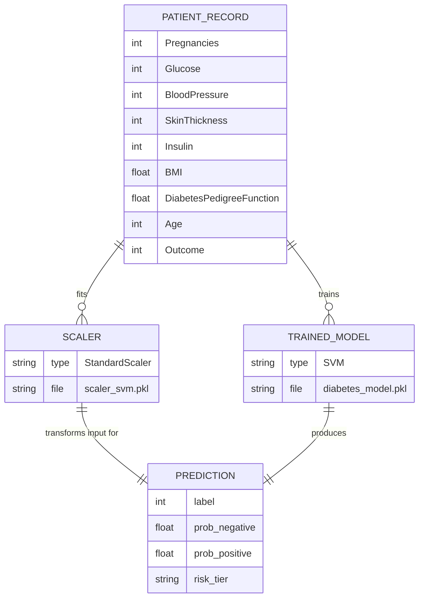

---

## 🔄 Application Workflow

### End-to-end user flow

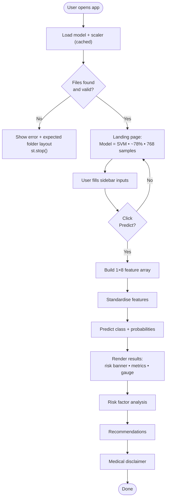

### Sequence diagram — one prediction

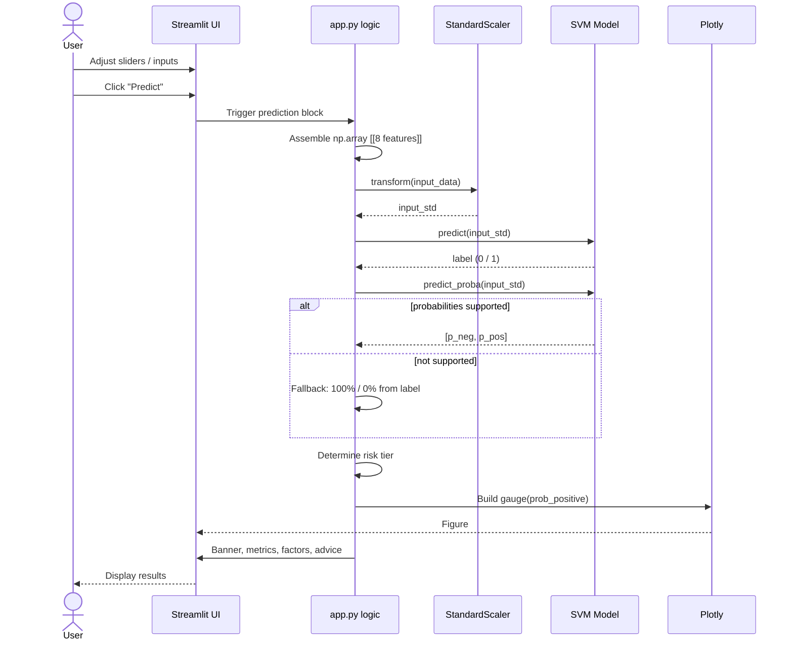

### Startup / model-loading sequence

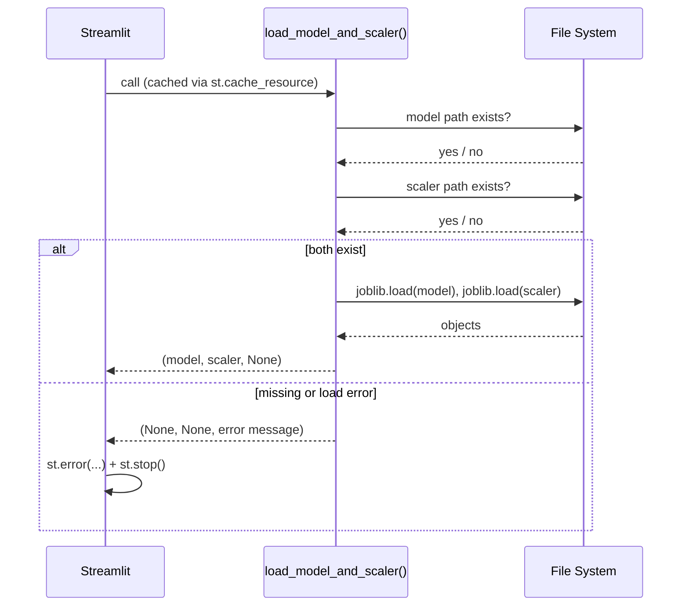

---

## 🎯 Risk Classification Logic

The displayed banner combines the **predicted class** with the **diabetic probability** (`P`):

| Predicted class | Probability of diabetes (P) | Banner |
|---|---|---|
| 0 (Non-diabetic) | P < 30 % | 🟢 LOW RISK – Not Diabetic |
| 0 (Non-diabetic) | P ≥ 30 % | 🟡 MODERATE RISK – Not Diabetic |
| 1 (Diabetic) | P > 70 % | 🔴 HIGH RISK – Diabetic |
| 1 (Diabetic) | P ≤ 70 % | 🟡 MODERATE RISK – Diabetic |

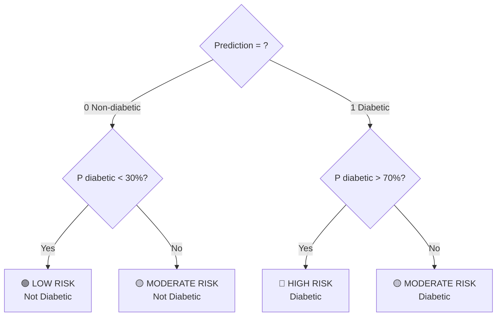

### State diagram — risk gauge zones

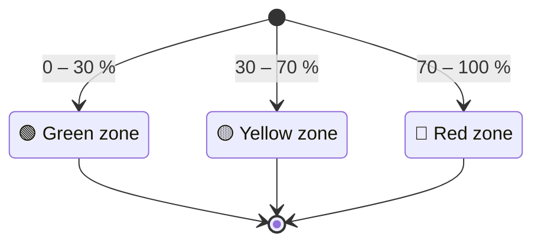

---

## 🧠 Risk Factor & Recommendation Engine

Independent of the ML output, `app.py` applies simple clinical heuristics to the raw inputs to give the user context.

| Input | Condition | Message | Type |
|---|---|---|---|
| Glucose | > 125 mg/dL | 🔴 High glucose level | Risk |
| Glucose | < 100 mg/dL | 🟢 Normal glucose level | Positive |
| BMI | > 30 | 🔴 High BMI | Risk |
| BMI | 18.5 – 24.9 | 🟢 Healthy BMI | Positive |
| Age | > 45 | 🟡 Age-related risk factor | Risk |
| Blood pressure | > 80 mm Hg | 🔴 Elevated blood pressure | Risk |
| Blood pressure | 60 – 80 mm Hg | 🟢 Within selected range | Positive |
| Pedigree function | > 0.5 | 🟡 Higher pedigree function | Risk |

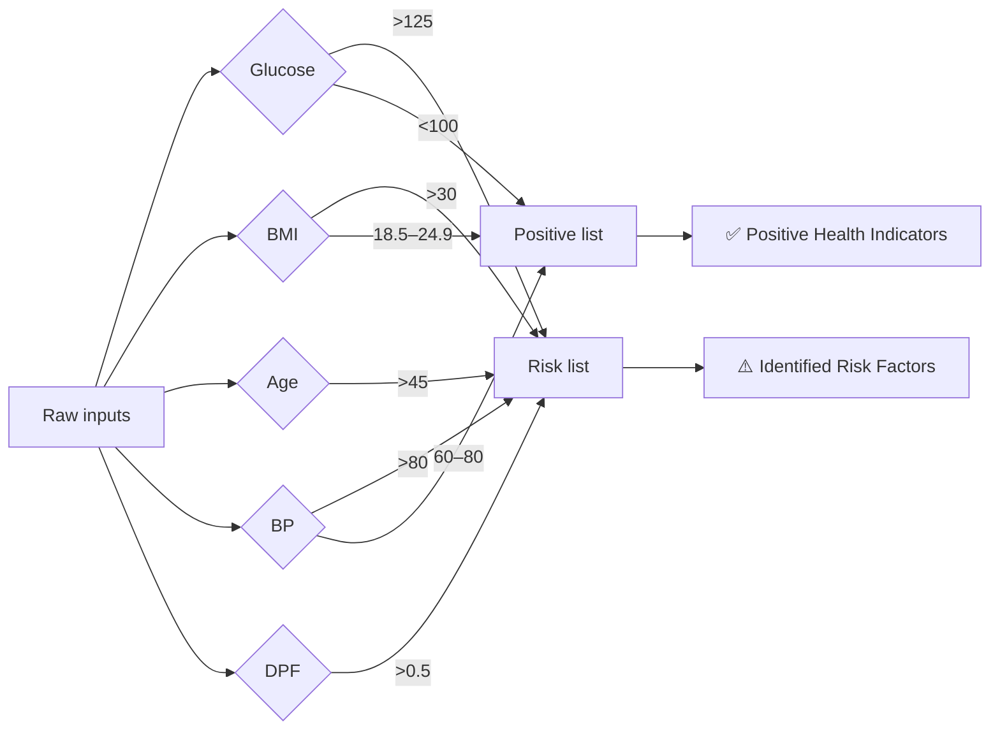

**Recommendations** shown after prediction:

- **Diabetic prediction (1):** consult a healthcare professional, consider screening, monitor glucose as advised, keep a balanced diet and stay active.
- **Non-diabetic prediction (0):** maintain balanced diet, exercise regularly, keep a healthy weight, continue regular check-ups.

---

## 📐 UML & Design Diagrams

### Use-case diagram

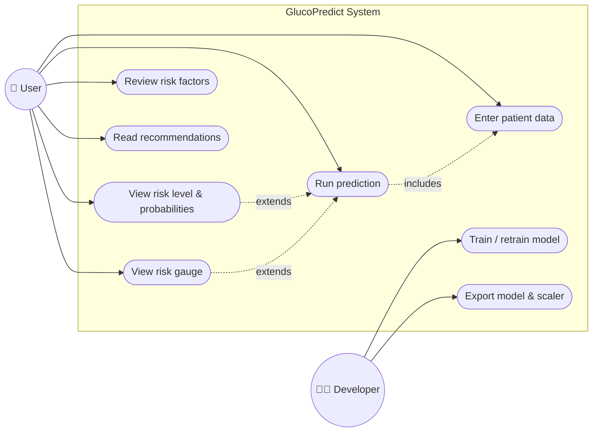

### Component diagram

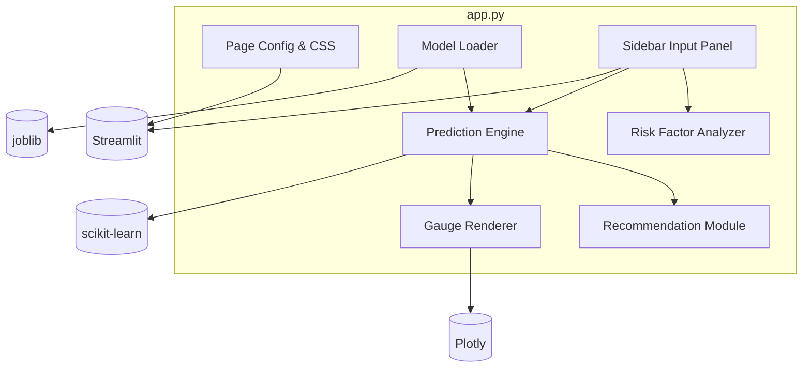

### Class diagram (logical)

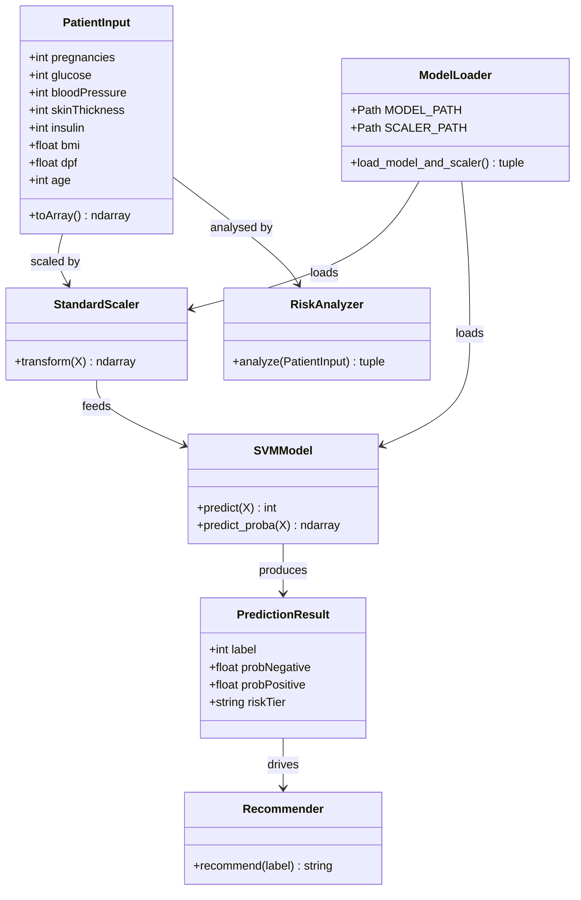

### Data-flow diagram (Level 1)

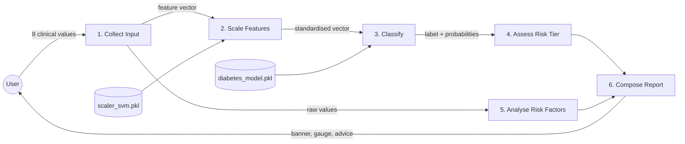

### Activity diagram — developer retraining workflow

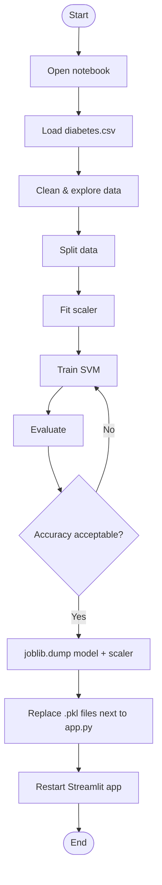

### Deployment diagram

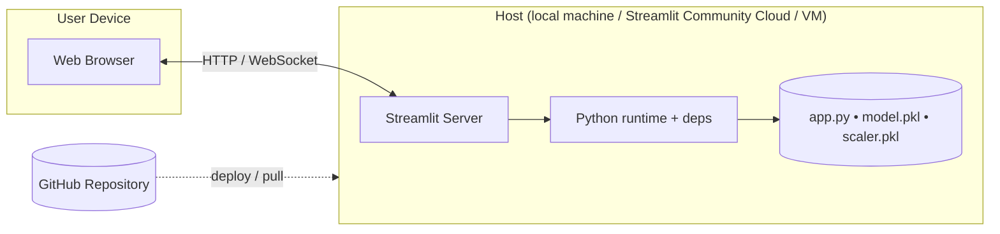

### Project timeline (suggested Gantt)

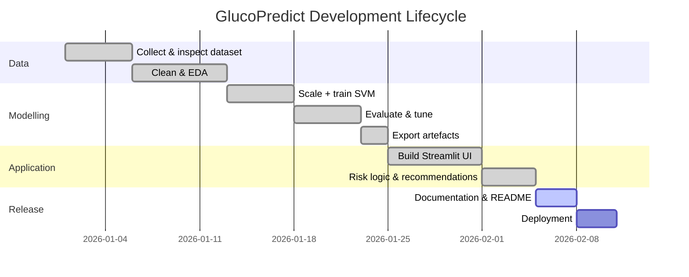

*(Dates are illustrative placeholders — adjust to your actual timeline.)*

### Mind map

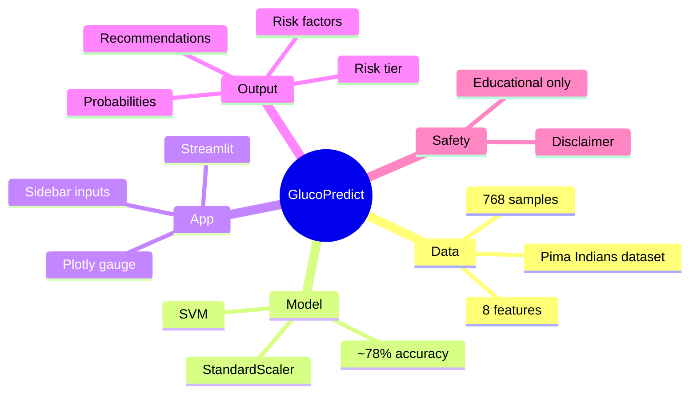

---

## 🚀 Installation & Usage

### 1. Clone the repository

```bash
git clone https://github.com/charveemasand108/GlucoPredict-.git
cd GlucoPredict-
```

### 2. Create a virtual environment

```bash
python -m venv .venv
# Windows
.venv\Scripts\activate
# macOS / Linux
source .venv/bin/activate
```

### 3. Install dependencies

The repository's `requirements.txt` is currently empty. Use the following (pin the versions you trained with, especially **scikit-learn**, so the `.pkl` files load correctly):

```text
streamlit
pandas
numpy
scikit-learn
joblib
plotly
```

```bash
pip install -r requirements.txt
```

### 4. Run the app

```bash
streamlit run app.py
```

Open the URL shown in the terminal (usually `http://localhost:8501`).

### 5. Using the app

1. Set the patient's **age** and **pregnancies**.
2. Enter **glucose, blood pressure, skin thickness, insulin, BMI** and **pedigree function**.
3. Click **🔮 Predict**.
4. Read the risk banner, probability metrics, gauge, risk factors and recommendations.

### Retraining the model

Open `diabetes-prediction.ipynb`, run all cells, and save the new artefacts:

```python
import joblib
joblib.dump(model,  "diabetes_model.pkl")
joblib.dump(scaler, "scaler_svm.pkl")
```

Keep the feature order: `Pregnancies, Glucose, BloodPressure, SkinThickness, Insulin, BMI, DiabetesPedigreeFunction, Age`.

---


---

## ⚠️ Limitations & Known Issues

- **Not a medical device.** The model is trained on a small, single-population dataset and is for learning only.
- **Dataset scope.** The Pima dataset covers adult women of Pima Indian heritage, aged 21+; results may not generalise to other populations or to men.
- **Zero values.** Sliders allow `0` for glucose, blood pressure, skin thickness and insulin. In this dataset zeros usually mean *missing*, and are not physiologically valid — consider raising the minimum values or adding validation.
- **Probability fallback.** If the SVM was not trained with `probability=True`, `predict_proba` is unavailable and the app shows 0 % / 100 %, which makes the gauge and risk tiers less informative.
- **Hard-coded metrics.** The landing page shows "~78 %" accuracy and "768 samples" as static text rather than values read from the evaluation.
- **Heuristic risk factors.** The risk-factor panel uses fixed thresholds, independent of the model; it is not feature importance. The "BP > 80" rule is a diastolic-style cut-off.
- **Empty `requirements.txt`.** Environment reproduction currently relies on manual installation.
- **Artefact compatibility.** `.pkl` files depend on the scikit-learn version used to create them.
- **No README / licence** in the original repository.

---

## 🔮 Future Improvements

- [ ] Populate `requirements.txt` with pinned versions
- [ ] Add input validation and treat zeros as missing values
- [ ] Compare SVM with Logistic Regression, Random Forest, XGBoost
- [ ] Add model explainability (SHAP / LIME) in place of fixed-threshold rules
- [ ] Probability calibration (`CalibratedClassifierCV`)
- [ ] Display real evaluation metrics (ROC-AUC, precision, recall, confusion matrix)
- [ ] Batch prediction via CSV upload
- [ ] Unit tests and CI with GitHub Actions
- [ ] Dockerise and publish a live demo
- [ ] Multilingual interface

---

## 🤝 Contributing, License & Acknowledgements

**Contributing:** Fork the repo, create a feature branch, commit your changes, and open a pull request.

**License:** No licence has been specified yet. Consider adding one (e.g. MIT) to the repository.

**Acknowledgements**
- Pima Indians Diabetes Database (National Institute of Diabetes and Digestive and Kidney Diseases) via the UCI / Kaggle repositories
- scikit-learn, Streamlit and Plotly communities

---

**Author:** [@charveemasand108](https://github.com/charveemasand108)
